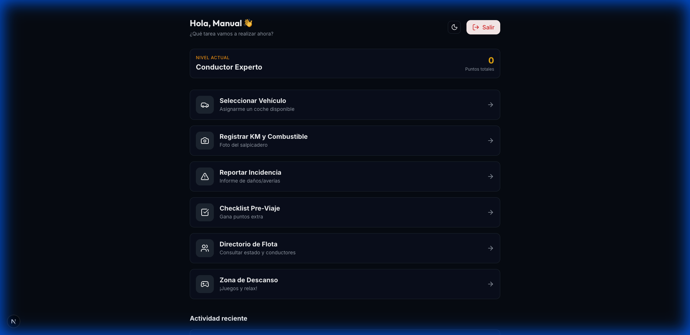
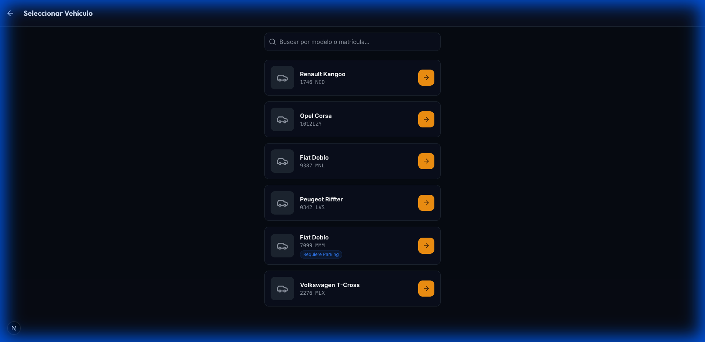
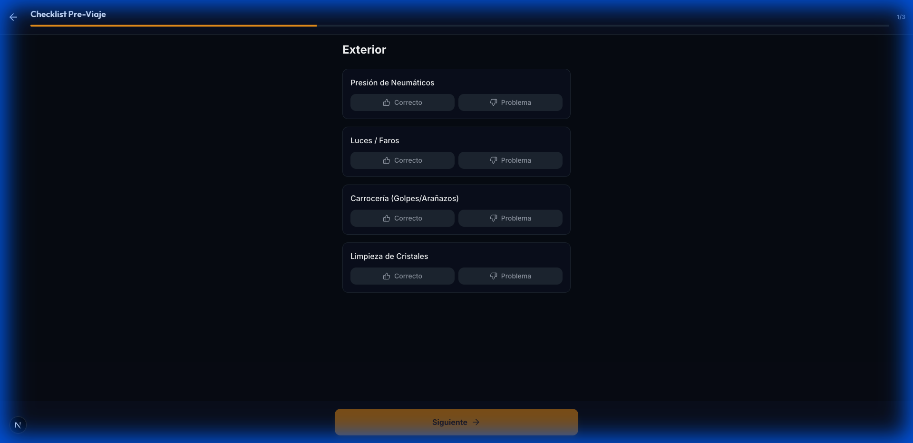
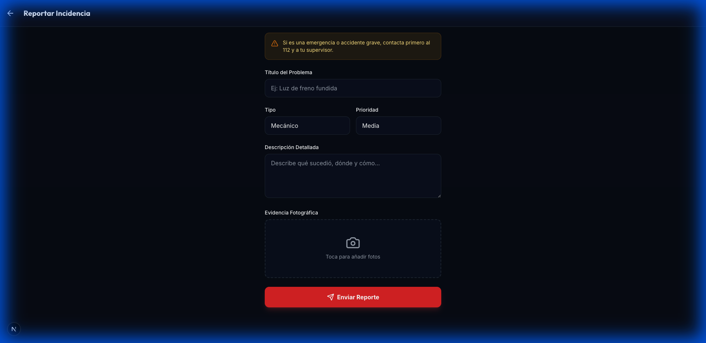
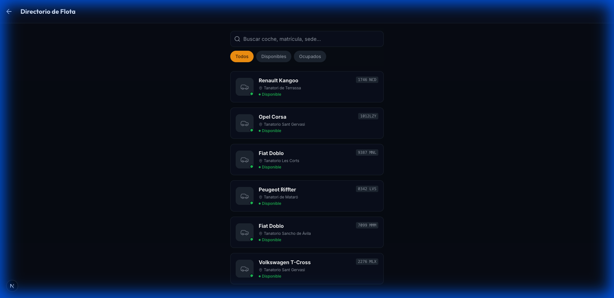
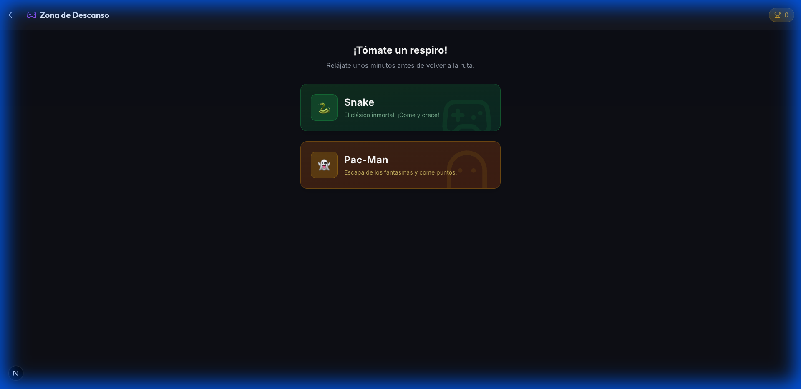

# Manual de Usuario - Portal del Conductor
**Marcha Fúnebre - Gestión de Flota y Material Musical**

Bienvenido al manual oficial para conductores. Esta guía le ayudará a utilizar la aplicación móvil para gestionar sus tareas diarias, desde la selección de vehículos hasta el reporte de incidencias.

---

## 1. Acceso a la Aplicación

Para comenzar a trabajar, debe iniciar sesión con su cuenta.

### Iniciar Sesión
1.  Abra la aplicación en su dispositivo móvil.
2.  Introduzca su **Email** y **Contraseña**.
3.  Pulse el botón **"Iniciar Sesión"**.

> **Nota**: Si es su primera vez, pulse en "¿No tienes cuenta? Regístrate" para crear su perfil.

---

## 2. Pantalla Principal (Dashboard)

Una vez dentro, verá el **Panel de Control**. Este es su centro de mando.

### Elementos Clave:
-   **Estado Actual**: Muestra si tiene un vehículo asignado o si está en descanso.
-   **Acciones Rápidas**: Botones grandes para las tareas más comunes como "Iniciar Ruta", "Reportar Incidencia" o "Ver Directorio".
-   **Resumen de Puntos**: Puede ver su puntuación de gamificación y nivel actual.

---

## 3. Selección de Vehículo

Antes de iniciar cualquier ruta, debe indicar qué vehículo va a utilizar.

### Cómo seleccionar un vehículo:
1.  Vaya a la sección **"Seleccionar Vehículo"** desde el menú o el Dashboard.
2.  Verá una lista de vehículos disponibles en su sede.
3.  Pulse sobre el coche que va a conducir (por ejemplo, "Renault Kangoo 1746 NCD").
4.  Confirme la selección. El vehículo quedará "Ocupado" por usted.

---

## 4. Checklist de Salida (Inspección)

Por seguridad, es recomendable realizar una inspección rápida antes de salir.

### Pasos:
1.  El sistema le mostrará una lista de puntos a revisar (Luces, Neumáticos, Daños, Limpieza).
2.  Marque "OK" si está todo correcto.
3.  Si hay algún problema, marque "Fallo" y podrá añadir una nota.
4.  Al finalizar, pulse **"Guardar Inspección"**. Esto dejará constancia de que el vehículo estaba en buen estado al tomarlo.

---

## 5. Reportar Incidencias

Si ocurre algún percance (accidente, avería, multa) o detecta daños, debe reportarlo inmediatamente.

### Cómo crear un reporte:
1.  Pulse en **"Nueva Incidencia"**.
2.  Seleccione el **Tipo** (Accidente, Mantenimiento, Multa, Limpieza).
3.  Indique la **Prioridad** (Baja, Media, Alta, Urgente).
4.  Escriba una breve **Descripción** de lo ocurrido.
5.  Pulse **"Enviar Reporte"**. El administrador recibirá una alerta instantánea.

---

## 6. Directorio de Contactos

¿Necesita llamar a un compañero, a un taller o a la oficina? No necesita guardar los números en su agenda personal.

-   Busque por nombre o departamento.
-   Pulse el icono de **Teléfono** para llamar directamente.
-   Pulse el icono de **Email** para enviar un correo.

---

## 7. Zona de Descanso (Juegos)

Durante sus pausas, puede relajarse en la zona de juegos y ganar puntos extra.

-   Acceda a minijuegos sencillos (como Snake o Memory).
-   Cada minuto de juego le otorga **1 punto** de experiencia.
-   ¡Compita sanamente con sus compañeros para subir en el ranking!

---

## 8. Finalizar Turno

Al terminar su jornada:
1.  Asegúrese de aparcar el vehículo correctamente.
2.  Vaya al Dashboard y pulse **"Finalizar Uso"** para liberar el vehículo (si aplica).
3.  Desde el menú lateral, pulse **"Cerrar Sesión"** para proteger su cuenta.

---
*Generado automáticamente para Marcha Fúnebre App - 2024*
